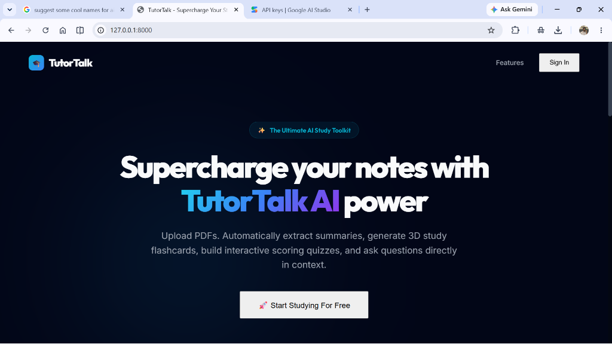
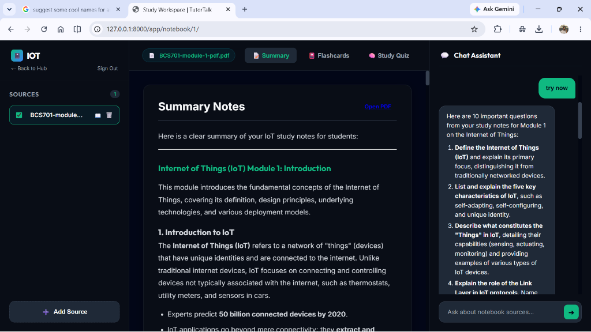
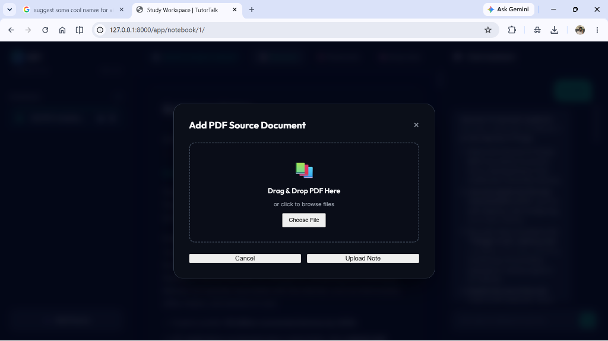
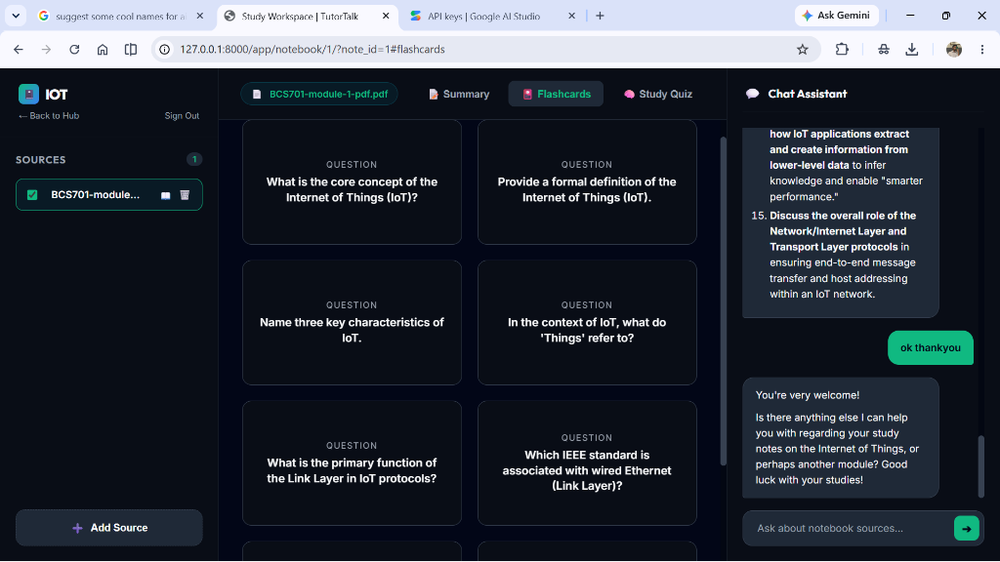
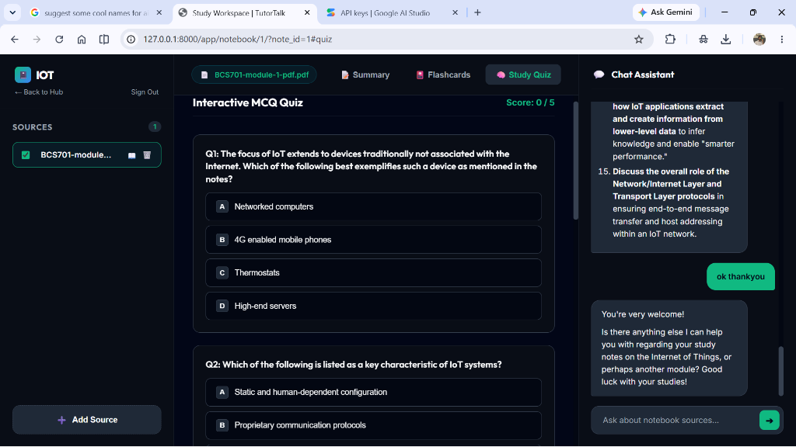

# 🎓 TutorTalk: Multi-Notebook AI Study Assistant

**TutorTalk** is an advanced, full-stack AI-powered study platform styled like Google NotebookLM. It allows learners to upload study materials (PDFs), organize them into dedicated color-coded notebook workspaces, toggle specific documents to act as RAG (Retrieval-Augmented Generation) context, and engage with a highly capable, structured AI Tutor that formats explanations with Markdown, KaTeX equations, and Mermaid.js diagrams.

The landing page features a premium dark-themed "Turbo AI" aesthetic with animated quotes from historical thinkers: Albert Einstein, Marie Curie, and Nelson Mandela.

---

## 🌟 Key Features

### 📂 Multi-Notebook Organization
* Create and delete multiple study notebook workspaces.
* Assign custom color badges to notebooks for easy categorization.
* Dynamic card grid overview with quick deletion options.

### 📄 Document & Source Management
* **Upload Progress Indicator**: Real-time visual feedback showing upload states during PDF processing.
* **Granular Source Control**: Toggle individual sources (notes) on/off. The AI chat assistant dynamically adjusts its context based only on the sources you select.
* **Source Deletion**: Permanently remove unwanted PDFs from your notebook context.

### 💬 Structured AI Tutor Chat
* **Beautiful Formatting**: Answers are parsed dynamically with support for bolding, bullet points, headers, and code blocks using `marked.js`.
* **LaTeX Equations**: Mathematical, physical, and chemical symbols are beautifully typeset in real time using `KaTeX`.
* **Mermaid.js Flowcharts**: AI-generated diagrams and flowcharts render as interactive visual components.
* **Viewport Scrolling**: Vertical scrollbars are locked to the chat area, ensuring control panels remain visible.

### ⚡ Premium UI/UX Design
* A dark mode aesthetic (`#020617` and `#0b0f19`) featuring subtle glassmorphic elements, hover transitions, and animations.
* Interactive quote gallery on the landing page featuring historic leaders.

---

## 🖥️ Screenshot Showcase

Here is a visual walkthrough of TutorTalk in action:

### 1. Turbo AI Landing Page
A dark-themed premium landing screen featuring the project name, clean action buttons, and animated moving quotes of historical figures.


### 2. Interactive Study Workspace
The heart of TutorTalk, combining multi-source toggle control, document summary viewer, and the structured AI Chat Assistant side-by-side.


### 3. Add Source Modal
A modern drag-and-drop file upload dialog for staging PDF study materials.


### 4. Concept Flashcards
Dynamic study flashcards parsed automatically from the selected study documents.


### 5. Automated Practice Quizzes
Interactive multiple-choice exams generated on-the-fly to test your comprehension.


---

## 🛠️ Technology Stack

* **Backend Framework**: Python / [Django](https://www.djangoproject.com/)
* **Database**: [PostgreSQL](https://www.postgresql.org/)
* **AI Engine**: Google Gemini API via `google-generativeai`
* **PDF Parser**: `PyMuPDF` (fitz)
* **Frontend Core**: Vanilla HTML5, Vanilla CSS3 (custom CSS variables, gradients, keyframes), and Vanilla JavaScript
* **Frontend Rendering Libraries**:
  * Markdown parsing: `marked.js`
  * Math equations: `KaTeX`
  * Diagrams: `Mermaid.js`

---

## 📁 Repository Structure

The project directory structure is arranged as follows:

```text
AI_STUDY_ASSISTANT_/
├── venv/                       # Python Virtual Environment (gitignored)
├── ai_study_assistant/         # Django Web Application Folder
│   ├── core/                   # Main Django App (models, views, templates)
│   │   ├── migrations/         # Database migration logs
│   │   ├── templates/core/     # HTML templates (landing, dashboard, notebook_hub)
│   │   ├── models.py           # Database schemas for Notebooks, Notes, and Chats
│   │   ├── views.py            # Chat logic, RAG retrieval, and file uploading controller
│   │   └── urls.py             # App-level URL routing
│   ├── media/                  # Dynamic assets directory
│   │   ├── landing/            # Historical leader portraits (Curie, Einstein, Mandela)
│   │   ├── screenshots/        # Project screenshots for documentation (landing, workspace, etc.)
│   │   ├── notes/              # Uploaded PDF files (gitignored)
│   │   └── note_images/        # Extracted PDF page images (gitignored)

│   ├── tutortalk/              # Django Configuration package
│   │   ├── settings.py         # Main settings (Database configuration, static roots)
│   │   ├── urls.py             # Root URL routing
│   │   ├── wsgi.py             # Web Server Gateway Interface
│   │   └── asgi.py             # Asynchronous Server Gateway Interface
│   └── manage.py               # Django administrative CLI script
├── .gitignore                  # Git exclusion rules
├── requirements.txt            # Python dependencies lists
└── README.md                   # This project manual
```

---

## 🚀 Getting Started

### 📋 Prerequisites
Ensure you have the following installed on your machine:
* Python 3.10+
* PostgreSQL Database Server
* VS Code (Recommended editor)

### 🔧 Installation Steps

1. **Clone the Repository**
   ```bash
   git clone https://github.com/your-username/TutorTalk.git
   cd TutorTalk
   ```

2. **Open in VS Code**
   Open the **outermost folder `AI_STUDY_ASSISTANT_`** in VS Code.

3. **Activate the Virtual Environment**
   * On Windows:
     ```powershell
     .\venv\Scripts\Activate.ps1
     ```
   * On macOS/Linux:
     ```bash
     source venv/bin/activate
     ```

4. **Install Dependencies**
   ```bash
   pip install -r requirements.txt
   ```

5. **Configure the Database**
   Create a local PostgreSQL database named `ai_study_assistant` and verify database credentials match the configuration in `settings.py`:
   ```python
   DATABASES = {
       'default': {
           'ENGINE': 'django.db.backends.postgresql',
           'NAME': 'ai_study_assistant',
           'USER': 'postgres',
           'PASSWORD': 'YOUR_PASSWORD',
           'HOST': '127.0.0.1',
           'PORT': '5432',
       }
   }
   ```

6. **Set up Environment Variables**
   Create a `.env` file inside `ai_study_assistant/` (or set it in your environment settings) and add your Gemini API Key:
   ```env
   GEMINI_API_KEY=your_gemini_api_key_here
   ```

7. **Run Database Migrations**
   ```bash
   python manage.py migrate
   ```

8. **Start the Development Server**
   ```bash
   python manage.py runserver
   ```
   TutorTalk will be accessible locally at **http://127.0.0.1:8000/**.

---

## 🛡️ License
Distributed under the MIT License. See `LICENSE` for more information.
